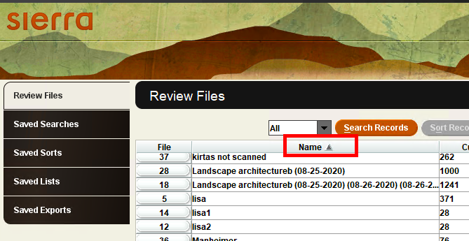

Sign in to the Sierra Desktop Application (SDA) on your Windows machine.  This can be done from your office PC or remotely using VPN access.

Use the drop-down list of Sierra functions to select _Create Lists_.  I usually navigate to the _Create Lists_ option using the Cataloging workflow but there are other valid ways to choose _Create Lists_.

Sort the review files alphabetically by double clicking on the column heading labeled ‘Name’.

